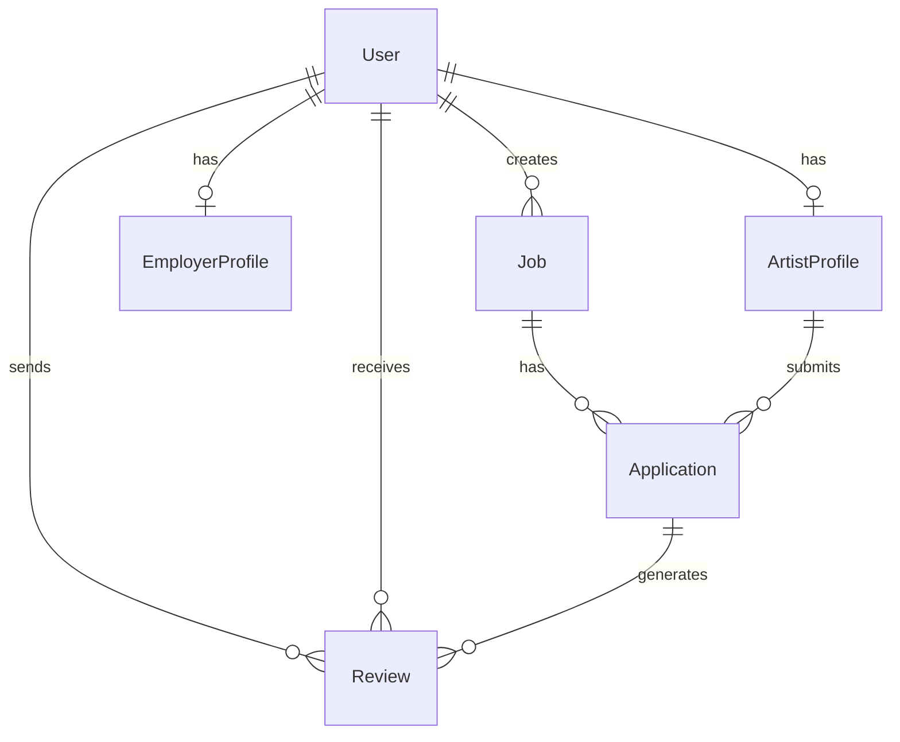

# 🏛 Architecture — Scenica

> **Imported from**: `PROJECT_CONTEXT.md`, `models.py` analysis
> **Date**: 2026-02-06
> **Modified**: 2026-02-27 (Translated to EN)

---

## Architectural Style

**Monolith Django** with applications separated by business domains.

---

## Core Data Models



---

## Key Entities

### User (AbstractUser)
- `role`: `artist` | `employer`
- `avatar`: ImageField
- `telegram_username`: contact
- Rating is calculated dynamically from `Review`

### ArtistProfile
- `genre`: genre (dancer_modern, acrobat, vocalist...)
- `country`, `gender`, `height`, `weight`, `birth_date`
- `is_visible`, `is_featured`, `is_urgent`
- `video_link`: video portfolio link

### EmployerProfile
- `company_name`, `website`, `description`
- `is_premium`, `premium_until` — subscription

### Job
- Linked to `employer` (User)
- `genre` taken from ArtistProfile.GENRE_CHOICES
- `salary_min/max`, `currency`
- `contract_duration` (in days)
- Bonuses: `is_flight_paid`, `is_visa_paid`, `is_accommodation_paid`

### Application
- Link: `Job` ↔ `ArtistProfile`
- Statuses: `new` → `viewed` → `accepted`/`rejected`
- **Frozen fields**: job conditions are copied to the application upon creation
- Signatures: `employer_signature`, `artist_signature`
- Documents: `visa_document`, `ticket_document`

### Notification
- `recipient`, `message`, `link`
- `category`: `contract`, `vacancy`, `chat`, `system`
- `related_id`: object link

### Review
- `author` → `target`
- `rating` (1-5), `comment`
- Linked to `Application`

---

## Patterns

### 1. Frozen Fields Pattern
When an `Application` is created, job terms are "frozen" in the application.
This protects the artist from the employer changing terms after the application is submitted.

### 2. Signature-based Contract
A contract is considered signed only when both parties have provided their signatures.
`Application.is_fully_signed()` checks for the presence of both signatures.

### 3. Context Processors
`core/context_processors.py` — adds data to all templates
`jobs/context_processors.py` — job context

---

## Template Structure

```
templates/
├── base.html           # Main layout (72KB!)
├── core/
│   ├── index.html      # Home page
│   └── catalog.html    # Artist/Job catalog
├── jobs/               # Job templates
└── users/              # Profiles, auth
```
